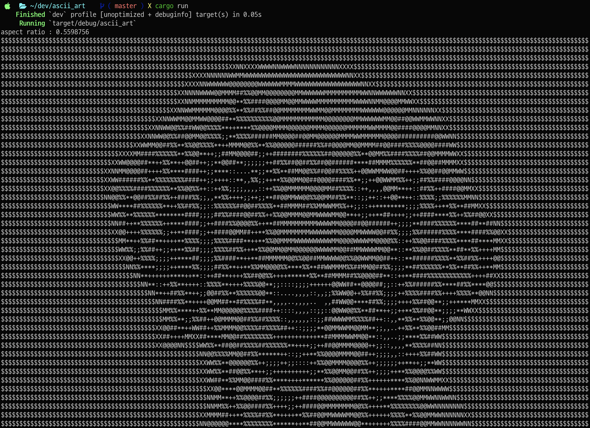

# ASCII ART in Rust

### Technologies:
- **Rust Programming Language**
- **image crate**: Used for image loading, resizing, and grayscale conversion operations.
- **Lanczos3 Filter**: A specific image scaling algorithm (`FilterType::Lanczos3`) used to resize the image while maintaining quality.

### Steps and Technologies Used:
1. **Image Loading**: 
   - using the `image` crate to load an image file.

2. **Aspect Ratio Calculation**:
   - using `img.dimensions()` to get the dimensions (width and height) of the loaded image.
   - calculated aspect ratio of the image to maintain proportions when resizing.

3. **Image Resizing**:
   - The image is resized to a desired width (`desired_width`) while maintaining the calculated aspect ratio using `img.resize_exact()`.

4. **Grayscale Conversion**:
   - resized image is converted to grayscale using `resized_img.grayscale()`.
   - this makes converting the brightness into an ASCII-character easier.

5. **ASCII Character Set**:
   - defining the ASCII-characters in vector (`ascii_chars`).
   - characters will be used to represent different brightness levels in the grayscale image.

6. **Generating ASCII Art**:
   - for each row of pixels
        - each pixel is realted to an ASCII-character based on the brightness level

7. **Printing ASCII Art**:
   - Finally, each row is printed.
